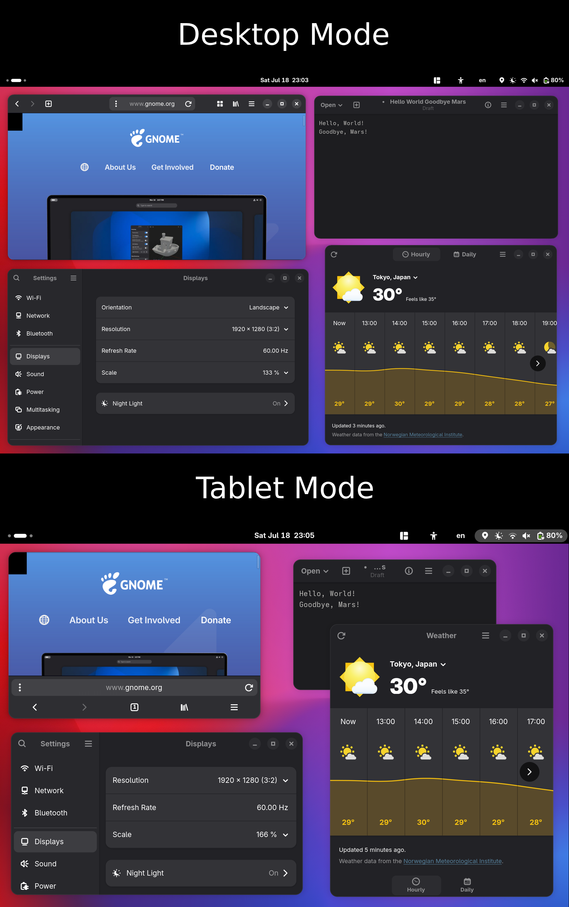
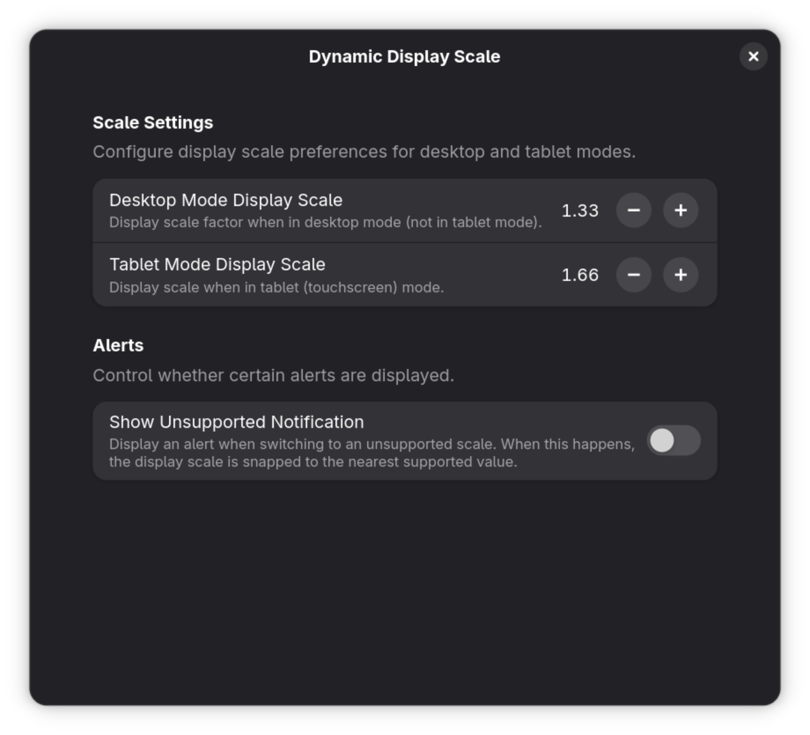

# Dynamic Display Scale


Dynamic Display Scale is a GNOME Shell extension that allows you to configure separate display scales for desktop and tablet modes.

This can be useful on touchscreens or 2-in-1 laptops where, for example, a larger scale would be more comfortable to use when in touch mode, but not in desktop mode.




> [!CAUTION]
> This extension is still experimental. Expect bugs and (potential) crashes when using it.

## But Why?

I created Dynamic Display Scale out of frustration with the lack of proper support for touchscreen devices. Don't get me wrong, the GNOME team is doing an amazing job keeping everything clean and polished in the desktop environment. But when it comes to touchscreen/tablet support, things start to get rough.

This is a relatively simple extension. There probably won't be much to configure or tweak in the preferences page. But (at least for me) adaptive scaling for touchscreen devices is an absolute necessity. Some apps and web pages are really tough to use on touchscreen with a desktop-oriented display scale. Buttons can get too tiny, text can appear small, etc. This extension attempts to fix that by allowing you to configure separate scaling profiles for both desktop mode and touch mode (see screenshots above).

## Setup Guide

This extension is not hosted anywhere but here, on this official GitHub page, at least for now. To install this extension, you must set it up manually. (Don't worry, it's a simple process!)

### Manual Installation

To install Dynamic Display Scale manually, follow the instructions:

1. Clone this repository:

```bash
git clone https://github.com/v81d/dynamic-display-scale.git
cd dynamic-display-scale
```

2. Pack the extension into a `.zip` archive:

```bash
gnome-extensions pack --extra-source=lib --podir=po .
```

3. Install the extension:

```bash
gnome-extensions install dynamic-display-scale@v81d.shell-extension.zip
```

To update the extension from an existing installation, pass the flag `--force`.

4. Log out and log in again to restart the GNOME Shell.

That's all. You can use the Extensions app to enable Dynamic Display Scale or run the command:

```bash
gnome-extensions enable dynamic-display-scale@v81d
```

Hopefully this extension brings as much convenience as it does for me! :)

## Contributing

### Reporting Issues

To report an issue or bug, visit the official [issue tracker](https://github.com/v81d/dynamic-display-scale/issues) on GitHub.

### Translating the Project

You can contribute by adding translations for strings in the application. See [TRANSLATING.md](TRANSLATING.md) for more information.

### Pull Requests

To push your features or fixes into this official repository:

1. Fork the repository.
2. Create a feature branch (`git checkout -b feature/my-feature`) or a fix branch (`git checkout -b fix/my-fix`).
3. Commit your changes (`git commit -m "feat: add new feature"`). **Please follow the [Conventional Commits](https://www.conventionalcommits.org) guideline when doing so!**
4. Push the branch (`git push origin feature/my-feature`).
5. Open a pull request with `contrib` as the base branch. Make sure to create a detailed title and description of your change.

Please follow the [GitHub flow](https://guides.github.com/introduction/flow) when submitting a pull request.

## License

Dynamic Display Scale is free software distributed under the **GNU General Public License, version 2.0 or later (GPL-2.0+).**

You are free to use, modify, and share the software under the terms of the GPL.
For full details, see the [GNU General Public License v2.0](https://www.gnu.org/licenses/gpl-2.0.html).
